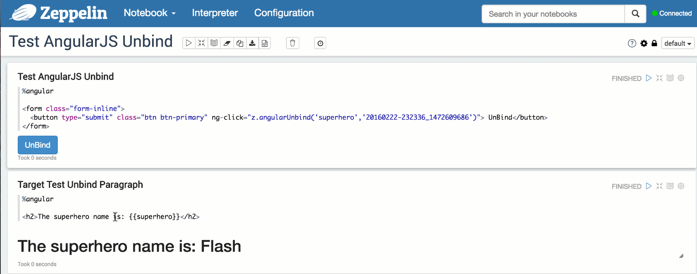
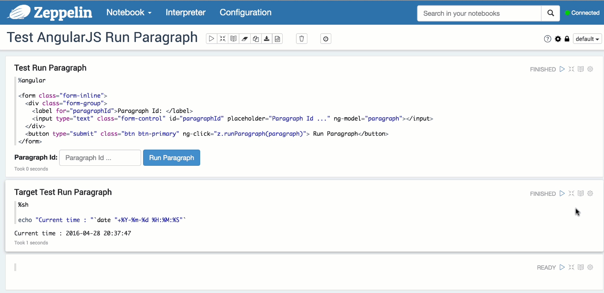

# 前端Angular API

原文链接 : [http://zeppelin.apache.org/docs/0.7.2/displaysystem/front-end-angular.html](http://zeppelin.apache.org/docs/0.7.2/displaysystem/front-end-angular.html)

译文链接 : [http://www.apache.wiki/pages/viewpage.action?pageId=10030670](http://www.apache.wiki/pages/viewpage.action?pageId=10030670)

贡献者 : [片刻](/display/~jiangzhonglian) [ApacheCN](/display/~apachecn) [Apache中文网](/display/~apachechina)

## 基本用法

除了用于处理Angular对象绑定[的后端API](http://zeppelin.apache.org/docs/0.7.1/displaysystem/back-end-angular.html)之外，Apache Zeppelin还在`**z**`前端暴露了一个简单的AngularJS 对象，以显示相同的功能。该`**z**`对象可以在每个段落的角度孤立的范围内访问。 

### 绑定/解除绑定变量

通过这个**`z`**，你可以绑定/取消绑定变量到**AngularJS视图**。将值绑定到角度对象和**强制**目标段落：

```
%angular 

<form class="form-inline">
  <div class="form-group">
    <label for="superheroId">Super Hero: </label>
    <input type="text" class="form-control" id="superheroId" placeholder="Superhero name ..." ng-model="superhero"></input>
  </div>
  <button type="submit" class="btn btn-primary" ng-click="z.angularBind('superhero',superhero,'20160222-232336_1472609686')"> Bind</button>
</form> 
```


* * *

解除/取消角度对象中的值和**强制性**目标段落：

```
%angular 

<form class="form-inline">
  <button type="submit" class="btn btn-primary" ng-click="z.angularUnbind('superhero','20160222-232336_1472609686')"> UnBind</button>
</form> 
```



功能的**`z.angularBind() / z.angularUnbind()`**签名是：

```
// Bind
z.angularBind(angularObjectName, angularObjectValue, paragraphId); 

// Unbind
z.angularUnbind(angularObjectName, angularObjectValue, paragraphId);
```

所有参数都是强制性的。

### [运行段落](http://zeppelin.apache.org/docs/0.7.1/displaysystem/front-end-angular.html#run-paragraph)

您还可以通过调用**`z.runParagraph()`**函数传递相应的paragraphId来触发段执行：

```
%angular 

<form class="form-inline">
  <div class="form-group">
    <label for="paragraphId">Paragraph Id: </label>
    <input type="text" class="form-control" id="paragraphId" placeholder="Paragraph Id ..." ng-model="paragraph"></input>
  </div>
  <button type="submit" class="btn btn-primary" ng-click="z.runParagraph(paragraph)"> Run Paragraph</button>
</form>
```



## 用角度对象覆盖动态窗体

前端Angular Interaction API旨在提供更丰富的表单功能和可变绑定。使用现有的**动态表单**系统，您可以创建输入文本，选择和复选框，但选择相当有限，无法更改外观和感觉。

这个想法是使用纯HTML / AngularJS代码创建一个自定义表单，并在此表单上绑定操作，以使用此新API将角度变量推送到目标段落。

因此，如果您在段落中使用**动态窗体**语法，并且有一个绑定的Angular对象具有与之相同的名称`${formName}`，则Angular对象将具有较高的优先级，并且不会显示**动态窗体**。例：


## 特征矩阵比较

如何在前端AngularJS API比较的[后端API](http://zeppelin.apache.org/docs/0.7.1/displaysystem/back-end-angular.html)？以下是两个API的比较矩阵：

| 操作 | 前端API | 后端API |
| --- | --- | --- |
| Initiate binding（启动绑定） | z.angularbind(var, initialValue, paragraphId) | z.angularBind(var, initialValue) |
| Update value（更新值） | same to ordinary angularjs scope variable, or z.angularbind(var, newValue, paragraphId) | z.angularBind(var, newValue) |
| Watching value（监听值） | same to ordinary angularjs scope variable | z.angularWatch(var, (oldVal, newVal) =&gt; ...) |
| Destroy binding（破坏绑定） | z.angularUnbind(var, paragraphId) | z.angularUnbind(var) |
| Executing Paragraph（执行段落） | z.runParagraph(paragraphId) | z.run(paragraphId) |
| Executing Paragraph (Specific paragraphs in other notes)（执行段落（其他说明中的具体段落）） |   | z.run(noteid, paragraphId) |
| Executing note（执行笔记） |   | z.runNote(noteId) |

两个API都非常相似，除了值得注意的是前端由AngularJS内部部件以及后端用户自定义观察器功能自然完成的情况。

范围方面也略有不同。前端API将Angular对象绑定到段落范围，而后端API允许您在全局或注释范围上绑定Angular对象。该限制是为了避免角度物体泄漏和污染范围而设计的。